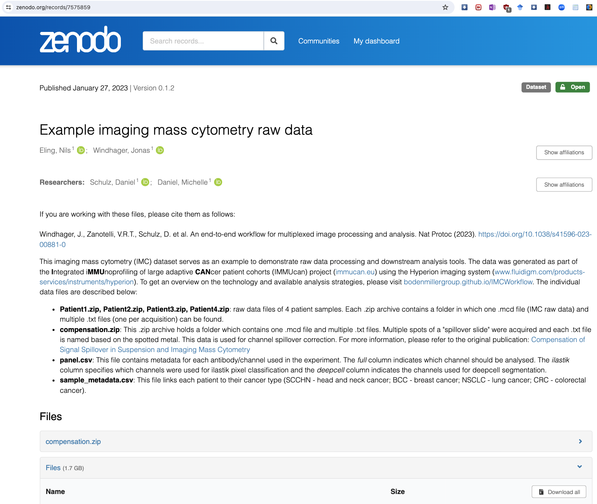

# Lab 4: IMC-example using the [steinbock](https://bodenmillergroup.github.io/steinbock) toolkit

This lab is part of our journey through computational imaging and modeling techniques, and the use of AI in biomedical applications related to Imaging Mass Cytometry (IMC). We will explore IMC data ([readimc](https://bodenmillergroup.github.io/readimc)) and use the _steinbock_ [toolkit](https://bodenmillergroup.github.io/steinbock). This requires the `bmed365imc` environment - check [here](./environment-imc.yml). <br>  _update: 2024-01-29_


<!-- <br> -->
<br>
If you have a subscription to [ChatGPT Plus](https://openai.com/blog/chatgpt-plus), you can also try out the the [**Medical AI Assistant (UiBmed - ELMED219 & BMED365)**](https://chat.openai.com/g/g-d90dfN17H-medical-ai-assistant-uibmed-elmed219-bmed365) [GPT](https://openai.com/blog/introducing-gpts) and see if you can get it to answer some of your questions, e.g.<br>
- "_Explain Imaging Mass Cytometry (IMC) to me_"
- "_How to read an .mcd-file in Python using readimc_?" 
- "_Provide 5 recent references on Imaging Mass Cytometry in brain cancer_"

---------------

## Data

<a href="https://doi.org/10.5281/zenodo.7575859"></a>




-----
Download Patient1.zip (from https://zenodo.org/records/7575859) and save it in the data folder. Unzip the file and you should have the following files in the data folder:
```bash
├── README.md
├── assets
│   └── example-imc-raw-data.png
├── data
│   ├── Patient1.mcd
│   ├── Patient1_pos1_1_1.txt
│   ├── Patient1_pos1_2_2.txt
│   └── Patient1_pos1_3_3.txt
├── environment-imc.yml
├── nbs
└── refs
```

### Video lectures:

- _Imaging Mass Cytometry in View: Researchers talk about how Imaging Mass Cytometry is driving high-multiplex tissue imaging_  by [Standard BioTools](https://www.standardbio.com/products/technologies/imaging-mass-cytometry) (previously Fluidigm) [[link](https://share.vidyard.com/watch/neWdnyfKFwf7wewcpErsZ6)] (2:31 min)
  
- _Uncovering Cellular Networks by Imaging Mass Cytometry_ by [Bernd Bodenmiller](https://scholar.google.com/citations?user=-crrFJYAAAAJ&hl=en), University of Zurich & ETH Zurich [[link](https://youtu.be/j3DSbg-oB8w?si=0PDiQHuHfvlUy26j)] (27:45 min)
   - see also the [Bodenmiller lab](https://www.bodenmillerlab.com) and their GitHub repo (https://github.com/BodenmillerGroup)

- _Tools and Trailblazers: Data Analysis Strategies and User-Developed Software Approaches_ by Standard BioTools IMC Forum [[link](https://videos.imaging.standardbio.com/watch/13scaWcA12JnXCZg8fsLQh)] (1:55:56 hrs)
   
### Readings:

- Standard BioTools. _Need some tips on getting started with IMC?_ Blog [[link](https://www.standardbio.com/resources/blog-articles/2022/imc-data-analysis-forum-session1)]

- Windhager, J., Zanotelli, V.R.T., Schulz, D. et al.  _An end-to-end workflow for multiplexed image processing and analysis_.  Nat Protoc (2023) [[link](https://doi.org/10.1038/s41596-023-00881-0)] 

- Willie, E., Yang, P., Patrick, E. _The impact of similarity metrics on cell-type clustering in highly multiplexed in situ imaging cytometry data_.  Bioinformatics Advances, Volume 3, Issue 1, 2023, vbad141 [[link](https://academic.oup.com/bioinformaticsadvances/article/3/1/vbad141/7301465)]

- Karimi E. ,...., Walsh L.A. _Single-cell spatial immune landscapes of primary and metastatic brain tumours_. Nature 2023;614:555–563 [[link](https://www.nature.com/articles/s41586-022-05680-3)]
  
### Repos:

-  _Multiplexed Tissue Imaging Workshop 2023_ (BodenmillerGroup) [[link](https://github.com/BodenmillerGroup/ImagingWorkshop2023)]

-  _steinbock_  [[link](https://github.com/BodenmillerGroup/steinbock)] A toolkit for processing multiplexed tissue images

- _IMC-Brain_ [[link](https://github.com/walsh-quail-labs/IMC_Brain)] Single-cell spatial immune landscapes of primary and metastatic brain tumors (MATLAB).
   - Data on [Zenodo](https://zenodo.org/records/7884599)
   - Nature paper (01 Feb 2023) [link](https://www.nature.com/articles/s41586-022-05680-3)

- _MCD Viewer_ [[link](https://www.standardbio.com/FluidigmSite_Assets/PrdSrv_Software/Software-Packages/MCD_Viewer/MCDViewer_V1.0.560.6_InstallationPack.zip)] A free software for viewing and exporting MCD files (Windows only).

<!--
- _100 Days of NLP </>_ by Raviraja Ghanta [[link](https://github.com/graviraja/100-Days-of-NLP)] A visual guide through NLP with Jupyter notebooks (using colab).
-->


