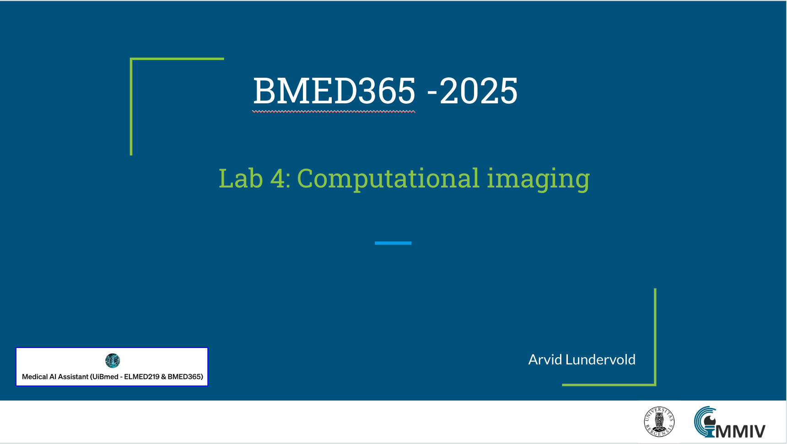

# Lab 4: Computational imaging

This lab is part of our journey through computational imaging and modeling techniques, and the use of AI in biomedical applications. It is designed to give you a comprehensive understanding of how computational imaging is transforming society in general and biomedicine in particular and the role it will play in the future of biomedical research.   _update: 2025-01-01_

<!--   -->
 
If you have a subscription to [ChatGPT Plus](https://openai.com/blog/chatgpt-plus), you can also try out the the [**Medical AI Assistant (UiBmed - ELMED219 & BMED365)**](https://chat.openai.com/g/g-d90dfN17H-medical-ai-assistant-uibmed-elmed219-bmed365) [GPT](https://openai.com/blog/introducing-gpts) and see if you can get it to answer some of your questions.

---------------

## Slides

<!--

-->

------
## Notebooks

| Notebook    |      1-Click Notebook      |
|:----------|------|
|  [01-imaging-intro.ipynb](https://nbviewer.jupyter.org/github/MMIV-ML/ELMED219/blob/main/Lab1-mpMRI-glioma/Lab-optional-imaging/01-imaging-intro.ipynb)  Illustration of basic concepts and methods in imaging   | |
|  [02-mri-intro.ipynb](https://nbviewer.jupyter.org/github/MMIV-ML/ELMED219/blob/main/Lab1-mpMRI-glioma/Lab-optional-imaging/02-mri-intro.ipynb)  Introduction to Magnetic Resonance Imaging   | |
|  [03-imc-intro.ipynb](https://nbviewer.jupyter.org/github/MMIV-ML/ELMED219/blob/main/Lab1-mpMRI-glioma/Lab-optional-imaging/03-imc-intro.ipynb)  Introduction to Imaging Mass Cytometry   | |

---

## Your turn!

Spend some time playing around with the provided examples. You'll find some questions for you to investigate in the notebooks. If you're already familiar with medical imaging and image analysis you can try your hand at more advanced examples, or, even better, help out other less experienced team members.

<!--
| Notebook    |      1-Click Notebook     
|:----------|------|
|  [1-comp-imag.ipynb](https://nbviewer.org/github/MMIV-ML/BMED365/blob/main/Lab4-Comp-Imag/1-comp-imag.ipynb)   Exploration of digital images (micro & macro), image processing, and computational imaging (eg. Gabor filtering)|  

-->

-----

## Learning motivations - watch these
(in the order of duration ...)

- _Uncovering Cellular Networks by Imaging Mass Cytometry_ by [Bernd Bodenmiller](https://scholar.google.com/citations?user=-crrFJYAAAAJ&hl=en), University of Zurich & ETH Zurich [[link](https://youtu.be/j3DSbg-oB8w?si=0PDiQHuHfvlUy26j)] (27:45 min)
   - see also the [Bodenmiller lab](https://www.bodenmillerlab.com) and their GitHub repo (https://github.com/BodenmillerGroup)

  
- _The future of computational imaging_ by [Gordon Wetzstein](https://scholar.google.com/citations?user=VOf45S0AAAAJ&hl=en), Stanford University [Computational Imaging Lab](https://www.computationalimaging.org) [[link](https://youtu.be/Vw6DdUAnRXU?si=1-CFfE628stSrFBe)] (35:48 min)
   - see also Stanford University School of Engineering: The Future of Everything [podcast](https://www.youtube.com/playlist?list=PL3FW7Lu3i5JvBYuJvDuDZliJFv9ZDmKs_) 
   
   
### Readings:
(in the order of most recent ...)

- Ma J et al. _Segment anything in medical images_ (article published online 22 Jan 2024) Nature Communications 2024;15:654 [[link](https://doi.org/10.1038/s41467-024-44824-z)] CC-BY-4.0. Their GitHub repo [[MedSAM](https://github.com/bowang-lab/MedSAM)] (SAM = Segment Anything Model)

- Tian D et al. _The role of large language models in medical image processing: a narrative review_ (article published online 3 Jan 2024) Quant Imaging Med Surg 2024;14(1):1108-1121 [[link](https://qims.amegroups.org/article/view/119330/html)] CC-BY-4.0

- Hu M et al. _Advancing medical imaging with language models: A journey from n-grams to ChatGPT_ ( preprint published online 11 Apr 20234) 	ArXiv 2023, /abs/2304.04920  [[link](https://arxiv.org/abs/2304.04920)]

- Srivastav S et al. _ChatGPT in radiology: The advantages and limitations of artificial intelligence for medical imaging diagnosis_ (published online Jul 6 2023) Cureus 2023; 15(7): e41435 [[link](https://www.ncbi.nlm.nih.gov/pmc/articles/PMC10404120)] CC-BY-4.0

  
### Repos:

- [Pavel Iakubovskii](https://www.linkedin.com/in/pavel-iakubovskii/?originalSubdomain=pt): _Segmentation models_  [[link](https://github.com/qubvel/segmentation_models.pytorch)]  (a very comprehensive Python library with Neural Networks for Image Segmentation based on PyTorch)

- [Yoni Chechik](https://www.linkedin.com/in/yoni-chechik): _AI_is_Math_ [[link](https://github.com/YoniChechik/AI_is_Math)] - frequently updated; MIT license; see also his https://www.aiismath.com and [AlgoMonkeys](https://www.algomonkeys.io) 
(a place to learn a wide range of computer vision and deep learning algorithms + the math behind them, including class notes and interactive notebooks)
   - Also listed in _Image processing notebooks_ [[link](https://github.com/topics/image-processing?l=jupyter+notebook)] - a list of 145 public repositories matching "Jupyter and Image processing" using algorithms to make computers analyze the content of digital images.
  
<!--
- _100 Days of NLP </>_ by Raviraja Ghanta [[link](https://github.com/graviraja/100-Days-of-NLP)] A visual guide through NLP with Jupyter notebooks (using colab).
-->

-----

### Other sources of inspiration:

- _152 Visual Phenomena & Optical Illusions with explanations_ (by Michael Bach) [[link](https://michaelbach.de/ot)]

