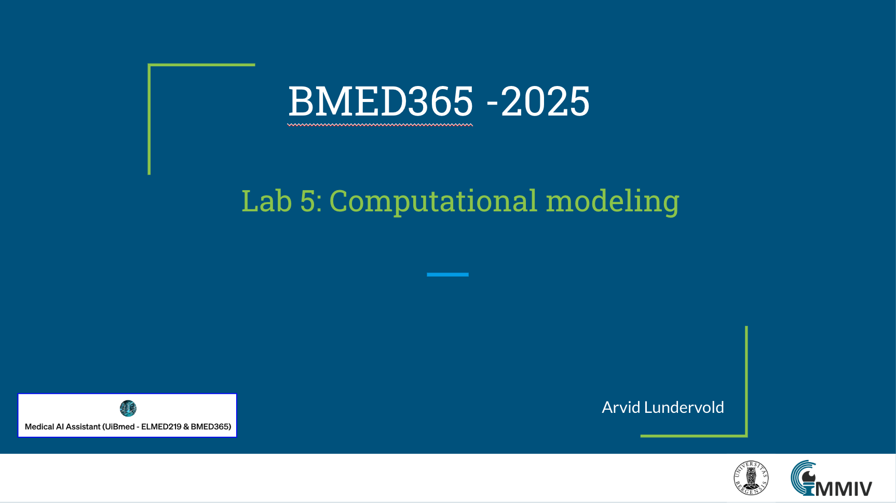

# Lab 5: Computational modeling

This lab is part of our journey through computational modeling techniques, and the use of AI in biomedical applications. It is designed to give you a comprehensive understanding of how computational modelinhg is transforming society in general and biomedicine in particular and the role it will play in the future of biomedical research.   _update: 2025-02-24_

<!--   -->
 
If you have a subscription to [ChatGPT Plus](https://openai.com/blog/chatgpt-plus), you can also try out the the [**Medical AI Assistant (UiBmed - ELMED219 & BMED365)**](https://chat.openai.com/g/g-d90dfN17H-medical-ai-assistant-uibmed-elmed219-bmed365) [GPT](https://openai.com/blog/introducing-gpts) and see if you can get it to answer some of your questions.

---------------

## Slides modeling

<!--

-->

------
## Notebooks

| Notebook    |      1-Click Notebook      |
|:----------|------|
|  [00-test-llm.ipynb](https://nbviewer.jupyter.org/github/MMIV-ML/BMED365-2025/blob/main/Lab5-Comp-Mod/00-test-llm.ipynb)  We test and explore a laptop installation of the powerful [**DeepSeek-R1**](https://arxiv.org/html/2501.12948v1) reasoning model   - the distilled _deepseek-r1:1.5b_, ..., _deepseek-r1:70b_ models)   | |
|  [01-action-potentials.ipynb](https://nbviewer.jupyter.org/github/MMIV-ML/BMED365-2025/blob/main/Lab5-Comp-Mod/notebooks/01-action-potentials.ipynb)  We explore the Hodgkin and Huxley model (HH-model) of action potentials | |
|  [02-tumor-growth.ipynb](https://nbviewer.jupyter.org/github/MMIV-ML/BMED365-2025/blob/main/Lab5-Comp-Mod/notebooks/02-tumor-growth.ipynb)  We explore a tumor growth and angiogeneisis model | |
|  [03-cardiovascular-flow.ipynb](https://nbviewer.jupyter.org/github/MMIV-ML/BMED365-2025/blob/main/Lab5-Comp-Mod/notebooks/03-cardiovascular-flow.ipynb)  We explore a cardiovascular flow model with added ECG and blood pressure waveforms | |
|  [04-muscle-force.ipynb](https://nbviewer.jupyter.org/github/MMIV-ML/BMED365-2025/blob/main/Lab5-Comp-Mod/notebooks/04-muscle-force.ipynb)  We explore a muscle force generation model (WIP)| |
|  [05-cell-signaling.ipynb](https://nbviewer.jupyter.org/github/MMIV-ML/BMED365-2025/blob/main/Lab5-Comp-Mod/notebooks/05-cell-signaling.ipynb)  We explore a cell signaling model and gene regulatory networks | |
|  [06-kidney-filtration.ipynb](https://nbviewer.jupyter.org/github/MMIV-ML/BMED365-2025/blob/main/Lab5-Comp-Mod/notebooks/06-kidney-filtration.ipynb)  We explore a kidney filtration model by prompting a LLM to generate a model | |

---

## Your turn!

Spend some time playing around with the provided examples. You'll find some questions for you to investigate in the notebooks. If you're already familiar with this level of computational modeling you can try your hand at more advanced examples, or, even better, help out other less experienced team members.

